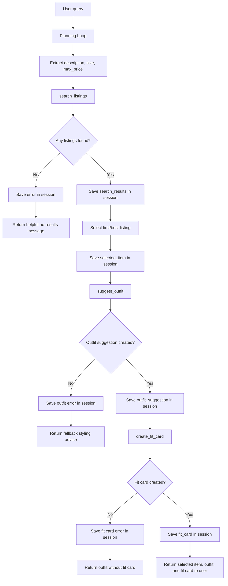

# FitFindr — planning.md

## Tools

### Tool 1: search_listings

**What it does:**
Searches the mock secondhand listings dataset for items that match the user's requested description, size, and maximum price. It returns a list of matching listings that the agent can choose from.

**Input parameters:**

* `description` (str): The clothing item or style the user is looking for, such as `"vintage graphic tee"` or `"black jacket"`.
* `size` (str): The user's preferred size, such as `"S"`, `"M"`, `"L"`, or `None` if no size is given.
* `max_price` (float): The highest price the user is willing to pay.

**What it returns:**
A list of matching listing dictionaries. Each result may include fields such as `id`, `title`, `description`, `category`, `style_tags`, `size`, `condition`, `price`, `colors`, `brand`, `platform`, and `image_url`.

**What happens if it fails or returns nothing:**
The tool returns an empty list instead of crashing. The agent tells the user that no listings matched and suggests changing the search, such as increasing the budget, removing the size filter, or trying a broader description.

---

### Tool 2: suggest_outfit

**What it does:**
Suggests one or more outfit combinations using the selected secondhand listing and the user's wardrobe. It explains how the new item can be styled with pieces the user already owns.

**Input parameters:**

* `new_item` (dict): The selected listing from `search_listings`, including details like title, category, color, price, size, and style tags.
* `wardrobe` (dict): The user's current wardrobe data, usually containing an `items` list with clothing pieces, shoes, or accessories.

**What it returns:**
A string describing a complete outfit suggestion. The suggestion should include the new item, one or more wardrobe pieces, and a short explanation of why the outfit works.

**What happens if it fails or returns nothing:**
If the wardrobe is empty, the tool returns general styling advice for the new item instead of crashing. If the LLM fails or cannot create a useful outfit, the agent gives a fallback outfit idea based on the item's category, color, and style.

---

### Tool 3: create_fit_card

**What it does:**
Creates a short, shareable fit card or caption based on the suggested outfit and selected secondhand item. The caption should sound fun, natural, and social-media ready.

**Input parameters:**

* `outfit` (str): The outfit suggestion created by `suggest_outfit`.
* `new_item` (dict): The selected listing used in the outfit.

**What it returns:**
A short caption-style string describing the thrifted item and outfit.

**What happens if it fails or returns nothing:**
If the outfit input is empty or incomplete, the tool returns a clear error message explaining that a fit card cannot be created without an outfit suggestion. The agent should not crash or return a blank response.

---

## Planning Loop

The agent starts by reading the user's natural language request and extracting the item description, size, and maximum price. It first calls `search_listings(description, size, max_price)`.

After `search_listings` runs, the agent checks whether the returned list is empty. If it is empty, the agent saves an error message in the session and stops early without calling `suggest_outfit` or `create_fit_card`.

If listings are found, the agent selects the most relevant listing, usually the first result, and stores it as `selected_item` in the session. Then it calls `suggest_outfit(selected_item, wardrobe)`. If an outfit suggestion is returned, the agent stores it as `outfit_suggestion`.

Finally, the agent calls `create_fit_card(outfit_suggestion, selected_item)` and stores the result as `fit_card`. The agent is done when it has either created a fit card or reached an error path that requires stopping early.

---

## State Management

The agent uses a session dictionary to store information across tool calls. This allows each tool's output to become the input for the next tool without asking the user to re-enter information.

The session tracks:

* `user_query`: the original user request
* `description`: the extracted item description
* `size`: the extracted size
* `max_price`: the extracted price limit
* `search_results`: the list returned by `search_listings`
* `selected_item`: the listing chosen from the search results
* `wardrobe`: the user's wardrobe data
* `outfit_suggestion`: the string returned by `suggest_outfit`
* `fit_card`: the final caption returned by `create_fit_card`
* `error`: any error message if a tool fails or returns unusable output

For example, after `search_listings` returns results, the agent stores the first listing in `session["selected_item"]`. That same value is then passed into `suggest_outfit`. The outfit returned by `suggest_outfit` is stored in `session["outfit_suggestion"]` and then passed into `create_fit_card`.

---

## Error Handling

| Tool            | Failure mode                          | Agent response                                                                                                                                                                                                                          |
| --------------- | ------------------------------------- | --------------------------------------------------------------------------------------------------------------------------------------------------------------------------------------------------------------------------------------- |
| search_listings | No results match the query            | The agent saves an error message and tells the user no matching listings were found. It suggests broadening the search, increasing the max price, or removing the size filter. The agent stops early and does not call the other tools. |
| suggest_outfit  | Wardrobe is empty                     | The agent still returns a useful styling suggestion using general outfit advice. It tells the user the suggestion is based on the item itself because no wardrobe items were available.                                                 |
| create_fit_card | Outfit input is missing or incomplete | The agent returns a clear message saying it cannot create a fit card without an outfit suggestion. It does not crash or return an empty string.                                                                                         |

---

## Architecture

---

## AI Tool Plan

**Milestone 3 — Individual tool implementations:**

I will use ChatGPT or Claude to help implement each tool one at a time. For `search_listings`, I will provide the Tool 1 specification from this planning document and ask the AI to implement the function using `load_listings()` from `utils/data_loader.py`. I will verify the output by testing at least three searches: one that returns results, one that returns no results, and one that checks the max price filter.

For `suggest_outfit`, I will provide the Tool 2 specification, the wardrobe schema, and an example selected listing. I expect the AI to produce a function that calls Groq’s `llama-3.3-70b-versatile` model and handles an empty wardrobe without crashing. I will verify it by testing it once with `get_example_wardrobe()` and once with `get_empty_wardrobe()`.

For `create_fit_card`, I will provide the Tool 3 specification, a sample outfit string, and a sample selected listing. I expect the AI to produce a function that creates a short caption-style response using the LLM. I will verify that it returns a string, does not crash when the outfit is empty, and produces varied responses when run multiple times.

**Milestone 4 — Planning loop and state management:**

I will use ChatGPT or Claude to help implement the planning loop in `agent.py`. I will provide the Planning Loop, State Management section, Error Handling table, and Architecture diagram from this document. I expect the AI to produce a `run_agent()` function that calls tools conditionally, stores outputs in the session dictionary, and stops early when `search_listings` returns no results.

Before using the code, I will review whether the agent calls `suggest_outfit` only when search results exist and calls `create_fit_card` only when an outfit suggestion exists. I will test a full successful query and a no-results query to confirm that state passes correctly between tools and that the error path works.

---

## A Complete Interaction (Step by Step)

**Example user query:** "I'm looking for a vintage graphic tee under $30. I mostly wear baggy jeans and chunky sneakers. What's out there and how would I style it?"

**Step 1:**
The agent reads the user query and extracts:

* `description = "vintage graphic tee"`
* `size = None`
* `max_price = 30.0`

Then it calls:

`search_listings(description="vintage graphic tee", size=None, max_price=30.0)`

**Step 2:**
`search_listings` returns a list of matching listings. The agent stores this list in `session["search_results"]`.

The agent selects the first or most relevant result and stores it in `session["selected_item"]`.

Example selected item:

`"Faded Band Tee" — $22, Depop, good condition`

**Step 3:**
The agent calls:

`suggest_outfit(new_item=session["selected_item"], wardrobe=session["wardrobe"])`

The tool returns an outfit suggestion, such as pairing the band tee with baggy jeans and chunky sneakers for a relaxed 90s-inspired outfit.

The agent stores this in `session["outfit_suggestion"]`.

**Step 4:**
The agent calls:

`create_fit_card(outfit=session["outfit_suggestion"], new_item=session["selected_item"])`

The tool returns a short shareable caption.

The agent stores this in `session["fit_card"]`.

**Final output to user:**
The user sees the selected thrift listing, the outfit suggestion, and the final fit card caption.

Example:

Found item: Faded Band Tee — $22 on Depop, good condition.

Outfit idea: Pair it with baggy jeans and chunky sneakers for a relaxed vintage streetwear look. Add simple jewelry or a zip hoodie if you want to layer it.

Fit card: thrifted this faded band tee for $22 and styled it with baggy denim + chunky sneakers for an easy 90s streetwear fit.
